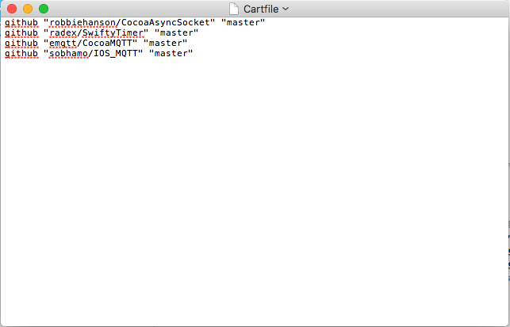
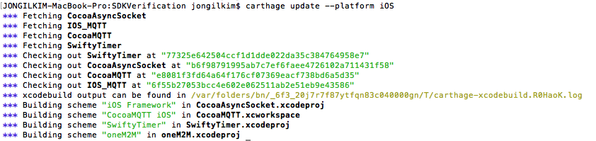
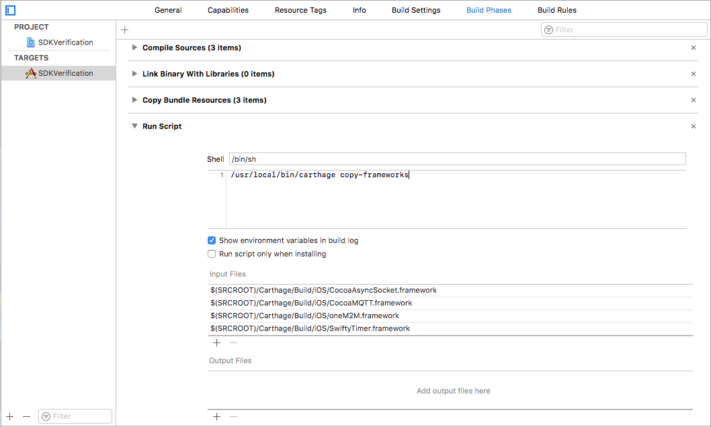
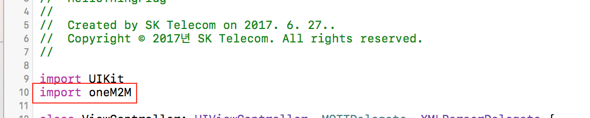

ThingPlug oneM2M framework for IOS
===

## Overview
ThingPlug oneM2M framework for IOS ThingPlug에 연동하고자 하는 device 개발자 및 application 개발자를 위한 IOS기반 framework입니다. IoT device 및 Application과 ThingPlug서버간의 통신에는 oneM2M 국제표준에 기반한 MQTT 프로토콜을 따르고 있으며, 보안강화를 위해 TLS를 사용할 수 있도록 구성되어 있습니다.

## Features
본 framework에서 제공되는 API를 사용하면 oneM2M 국제표준의 세부 규격을 모르더라도 손쉽게 ThingPlug와의 통신을 구현할 수 있습니다. framework뿐만 아니라 기본 기능시험을 위한 SDKVerification App을 같이 배포해드리고 있습니다.

## Requirements
* **[XCODE 8.3.3](https://developer.apple.com/download/more/)/ Swift 3.1**

### Library
본 framework에서의 ThingPlug와의 통신은 모두 MQTT를 통해서 이루어기에 MQTT client가 필요합니다.
IOS framework에서는 오픈소스 프로젝트인 CocoaMQTT를 사용하고 있으며, 오픈소스 프로젝트에 대해서는 아래 링크를 참고하시기 바랍니다.

라이브러리 | 기능 | 홈페이지
------------ | ------------- | -------------
CocoaMQTT | MQTT | **[CocoaMQTT github](https://github.com/emqtt/CocoaMQTT)**

## Getting Started
ThingPlug oneM2M framework는 소스코드 형태로 제공되며 Application에서의 사용을 위해서는 다음과 같이 import하여 사용하면 됩니다.
보다 자세한 사용 예시는 **[SDKVerification App](framework)** 소스코드를 참고하시기 바랍니다.

### Carthage 설치 및 framework 업데이트 
oneM2M framework는 framework의 원할한 업데이트 적용 및 import 편의를 위하여 Carthage를 사용합니다.
("https://github.com/Carthage/Carthage")

1. Carthage 설치 후 신규 Project 폴더에 Cartfile을 생성하고 아래 4개의 git 저장소 주소를 추가 후 저장합니다.

github "robbiehanson/CocoaAsyncSocket" "master"
github "radex/SwiftyTimer" "master"
github "emqtt/CocoaMQTT" "master"
github "sobhamo/IOS_MQTT" "master"



2. 터미널에서 Project 폴더로 이동 후 Carthage update 명령어를 입력합니다.
"carthage update --platform iOS" 후 ENTER


### Project에 oneM2M framework 연결
신규 Project에 oneM2M framework를 추가하고자 할 경우, 아래와 같이 추가하시기 바랍니다.
여기서 제공되는 SDKVerification App 프로젝트에는 이미 framework가 포함되어 있습니다.

1. TARGETS 선택(1번) -> Build Phases(2번) -> new run Script phase(3번) 
2. Run Script 선택 후  Script 영역(4번) 에 "/usr/local/bin/carthage copy-frameworks" 입력을 합니다.
3. Carthage를 통하여 생성된 frameworks를 Project에 input 합니다.(5번)



### oneM2M framework import

import oneM2M


### Setting for MQTT connection
MQTT server 와의 연결을 위한 정보를 oneM2M framework의 Host class 를 통해 설정해야 합니다.

```java
let HOST = Host(name: "name", host: "host",
                port: " port", clientId: "clientId", 
                userName: "userName", password: "password", 
                usingSSL: false, cleanSession: true)
```
함수 | 파라미터
------------ | -------------
__host______ | MQTT broker 주소
__clientId__ | MQTT 연결 clientID
__userName__ | MQTT 연결 username
__password__ | MQTT 연결 password
__port______ | MQTT 연결 port
__usingSSL__ | SSL 연결 여부
cleanSession | Session 삭제 여부


TLS 사용을 위해서는 MQTT broker 주소앞에 `ssl://` 을 포함하면 됩니다. 포트번호가 `8883`인 경우 생략 가능합니다.

TLS 사용 시, ThingPlug의 MQTT broker 주소는 다음과 같습니다.
```
ssl://thingplugtest.skitiot.com
```
TLS를 사용하지 않을 경우, MQTT broker 주소앞에 `tcp://` 를 포함하면 됩니다. 포트번호가 `1883`인 경우 생략 가능합니다.

TLS 미사용 시, ThingPlug의 MQTT broker 주소는 다음과 같습니다.
```
tcp://thingplugtest.skitiot.com
```


### Configuration for MQTT Message
MQTT 메시지에 사용되어질 정보를 MQTTConfiguration을 통해 설정해야 합니다.

```java
MQTTConfiguration config = new MQTTConfiguration(appEUI,
toBase,
deviceResourceID,
clientId);
```
파라미터 | 설명
------------ | -------------
__appEUI__ | AppEUI
__toBase__ | to 필드 시작 URL
__deviceResourceID__ | 장치 고유 ID (ex : MAC-address) 
__clientId__ | MQTT 연결 clientID

### Connects to an MQTT server
MQTT 서버에 연결 후, 각종 이벤트 처리를 위한 MQTTDelegate 선언 및 Delegate function을 추가해 주어야 합니다.


```java

	var mqttClient: MQTTClient = MQTTClient(host: HOST)

    override func viewDidLoad() {
        super.viewDidLoad()
        
        binder = oneM2M(mqttClient: mqttClient)
        
        subscribeTopics = [SubscribeTopic("/oneM2M/req/+/\(HOST.clientId!)"), SubscribeTopic("/oneM2M/resp/\(HOST.clientId!)/+")]
        
        mqttClient.delegate = self
        mqttClient.connect()
    }
    ....
    
    func mqtt(_ mqtt: MQTTClient, didConnect host: String, port: Int) {
        print("didConnect")
    }
    
    func mqtt(_ mqtt: MQTTClient, didConnectAck ack: MQTTConnAck) {
        print("didConnectAck")
    }
    
    func mqtt(_ mqtt: MQTTClient, didPublishMessage message: Message, id: UInt16) {
        print("didPublishMessage")
    }
    
    func mqtt(_ mqtt: MQTTClient, didPublishAck id: UInt16) {
        print("didPublishAck")
    }
    
    func mqtt(_ mqtt: MQTTClient, didSubscribeTopic topic: String) {
        print("didSubscribeTopic : \(topic):")
    }
    
    func mqtt(_ mqtt: MQTTClient, didUnsubscribeTopic topic: String) {
        print("didUnsubscribeTopic : \(topic):")
    }
    
    func mqttDidPing(_ mqtt: MQTTClient) {
        print("mqttDidPing")
    }
    
    func mqttDidReceivePong(_ mqtt: MQTTClient) {
        print("mqttDidReceivePong")
    }
    
    func mqttDidDisconnect(_ mqtt: MQTTClient, withError err: Error?) {
        print("mqttDidDisconnect")
    }
    
    func mqtt(_ mqtt: MQTTClient, didReceive trust: SecTrust, completionHandler: @escaping (Bool) -> Void) {
        print("didReceive")
    }
    
    func mqtt(_ mqtt: MQTTClient, didReceiveMessage message: Message, id: UInt16 ) {
        print("didReceiveMessage")
    }
```
파라미터 | 설명
------------ | -------------
__mqttClient__ | mqttClient.delegate 객체

### oneM2M API 
SKT ThingPlug 서버와 oneM2M 통신을 위한 API 는 `SDK_IOS/oneM2M/oneM2M.swift` 파일에 주로 정의되어 있습니다.
oneM2M 클래스 객체를 가져와 사용하면 됩니다.

함수 | 설명
------------ | -------------
__tpRegisterDevice__ | 장치를 등록한다. (node 와 remoteCSE 를 등록한다.)
__tpRegisterContainer__ | 센서를 등록한다. (container 를 등록한다.)
__tpRegisterMgmtCmd__ | 제어명령을 등록한다. (mgmtCmd 를 등록한다.)
__tpAddData__ | 센서정보를 추가한다. (contentInstance 의 content(con) 에 담을 정보를 추가한다.)
__tpReport__ | 센서정보를 등록한다. (contentInstance 를 등록한다.)
__tpResult__ | 제어결과를 업데이트한다. (execInstance 를 업데이트한다.)
> 각 함수별 파라미터 설명은 `SDK_IOS/oneM2M/oneM2M.swift`에서 확인

### 기기 등록
기기등록을 위한 `tpRegisterDevice` 함수의 사용예시는 다음과 같으며, 성공 실패 여부는 `MQTTCallback`에 등록된 `onResponse` 와 `onFailure` 이벤트 함수로 확인할 수 있습니다.

```java
    /**
     * @brief register node, remoteCSE
     * @param[in] resourceType : resource type
     * @param[in] fr : from
     * @param[in] to : to
     * @param[in] ri : request id
     * @param[in] mga : node mga
     * @param[in] nm : remoteCSE name
     * @param[in] cst : remoteCSE type
     * @param[in] passcode : remoteCSE passcode
     * @param[in] poa : remoteCSE pointOfAccess
     * @param[in] nl : remoteCSE nodeLink
     * @return UInt16 : publish message id(if success lager than 0)
     */
    public func tpRegisterDevice(_ resourceType: ResourceType,_ fr: String,_ to: String,_ ri: String,_ mga: String?,_ nm: String?,_ cst: String?,_ passCode: String?,_ poa: String?,_ nl: String?) -> UInt16 {
        return rc
    }
```
### 센서 등록
센서등록을 위한 `tpRegisterContainer` 함수의 사용예시는 다음과 같습니다.

```java
	/**
     * @brief register container
     * @param[in] fr : from
     * @param[in] to : to
     * @param[in] ri : request id
     * @param[in] nm : container name
     * @param[in] dKey : dKey
     * @param[in] lbl : labels
     * @return UInt16 : publish message id(if success lager than 0)
     */
    public func tpRegisterContainer(_ fr: String,_ to: String,_ ri: String,_ nm: String,_ dKey: String,_ lbl: String?) -> UInt16 {
        return rc
    }
```

### 액츄에이터 등록
제어가 가능한 액츄에이터등록을 위한 `tpRegisterMgmtCmd` 함수의 사용예시는 다음과 같습니다.

```java
/**
     * @brief register mgmtCmd
     * @param[in] fr : from
     * @param[in] to : to
     * @param[in] ri : request id
     * @param[in] nm : mgmtCmd name
     * @param[in] dKey : dKey
     * @param[in] cmt : cmdType
     * @param[in] exe : execEnable
     * @param[in] ext : execTarget
     * @param[in] lbl : labels
     * @return UInt16 : publish message id(if success lager than 0)
     */
    public func tpRegisterMgmtCmd(_ fr: String,_ to: String,_ ri: String,_ nm: String,_ dKey: String,_ cmt: String,_ exe: String,_ ext: String,_ lbl: String?) -> UInt16 {
        return rc
    }
```

### 센서 상태 보고
센서 상태 보고를 위한 `tpAddData`와 `tpReport` 함수의 사용예시는 다음과 같습니다.

```java
/**
     * @brief add content data of contentInstance
     * @param[in] data : data
     * @return Result : result code
     */
    public func tpAddData(_ data: String) -> Result {
        self.content.append(data)
        return .TP_SDK_SUCCESS
    }
    
        /**
     * @brief report
     * @param[in] fr : from
     * @param[in] to : to
     * @param[in] ri : request id
     * @param[in] dKey : dKey
     * @param[in] cnf : contentInfo
     * @param[in] con : content
     * @param[in] useAddedData : use added data flag
     * @return UInt16 : publish message id(if success lager than 0)
     */
    public func tpReport(_ fr: String,_ to: String,_ ri: String,_ dKey: String,_ cnf: String,_ con: String?,_ useAddedData: Bool) -> UInt16 {
        return rc
    }
```
> `tpAddData` 함수를 통하여 여러 센서의 정보를 수집할 수 있습니다.
> 이 경우 `tpReport` 함수의 useAddedData 파라미터를 true 로 설정하고, content 파라미터를 null 로 설정하면 그동안 `tpAddData` 함수를 통하여 수집된 content 정보가 서버로 전달됩니다.
> `tpAddData` 함수를 사용하지 않을 경우 useAddedData 파라미터를 false 로 설정하고, content 파라미터에 값을 입력하면 됩니다.

### 제어 결과 보고
제어 결과 보고를 위한 `tpResult` 함수의 사용예시는 다음과 같습니다.

```java
    /**
     * @brief report
     * @param[in] fr : from
     * @param[in] to : to
     * @param[in] ri : request id
     * @param[in] dKey : dKey
     * @param[in] exr : execResult
     * @param[in] exs : execStatus
     * @return UInt16 : publish message id(if success lager than 0)
     */
    public func tpResult(_ fr: String,_ to: String,_ ri: String,_ dKey: String,_ exr: String,_ exs: String) -> UInt16 {
        var rc: UInt16 = 0
        let execInstanceObj:execInstance = execInstance().ni(fr).dKey(dKey).exr(exr).exs(exs)
        rc = tp_oneM2M_V1_Request(.execInstance, .UPDATE, to, ri, execInstanceObj);
        return rc;
    }
```

### Error Code
`MQTTCallback`을 통해 발생한 응답의 성공 실패 여부를 확인하는 코드는 `SDK_IOS/oneM2M/Definitions.swift' 에 정의되어 있으며 다음과 같습니다.

```java
/**
 * Conn Ack
 */
public enum MQTTConnAck: UInt8 {
    case accept = 0
    case unacceptableProtocolVersion
    case identifierRejected
    case serverUnavailable
    case badUsernameOrPassword
    case notAuthorized
    case reserved
}


public enum Result: Int8 {
    case TP_SDK_SUCCESS = 0
    case TP_SDK_FAILURE = -1
    /**
     * Return code: Resource type or Operation is not supported
     */
    case TP_SDK_NOT_SUPPORTED = -13
    /**
     * Return code: Parameter is invalid
     */
    case TP_SDK_INVALID_PARAMETER = -14
}
```
## Sample Application(s)
* **[Simple Test App](SDK)** - oneM2M SDK 사용 Test App


Copyright (c) 2017 SK Telecom Co., Ltd. All Rights Reserved.
Distributed under Apache License Version 2.0.
