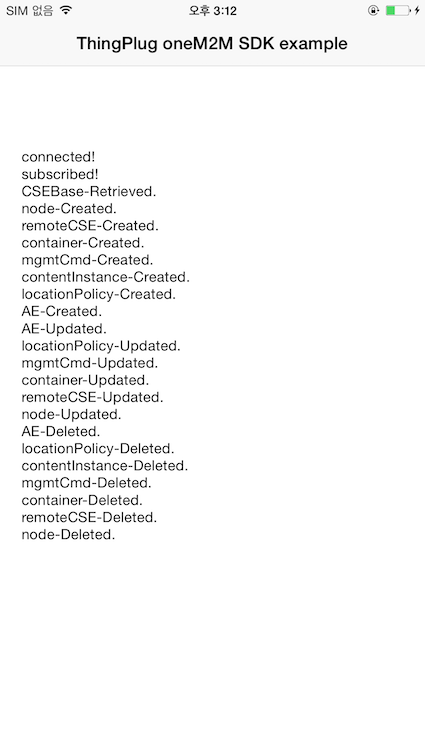

SDKVerification App
===
SDKVerification App 은 oneM2M SDK를 이용한 oneM2M API 동작과 ThingPlug서버와 연동이 정상적인지 확인 하기위한 App입니다.

## 동작
앱 실행시  
   - CREATE, RETRIEVE, UPDATE, DELETE 동작이 정상적으로 이루어지는지 보여 줍니다.
   

Copyright (c) 2017 SK Telecom Co., Ltd. All Rights Reserved.
